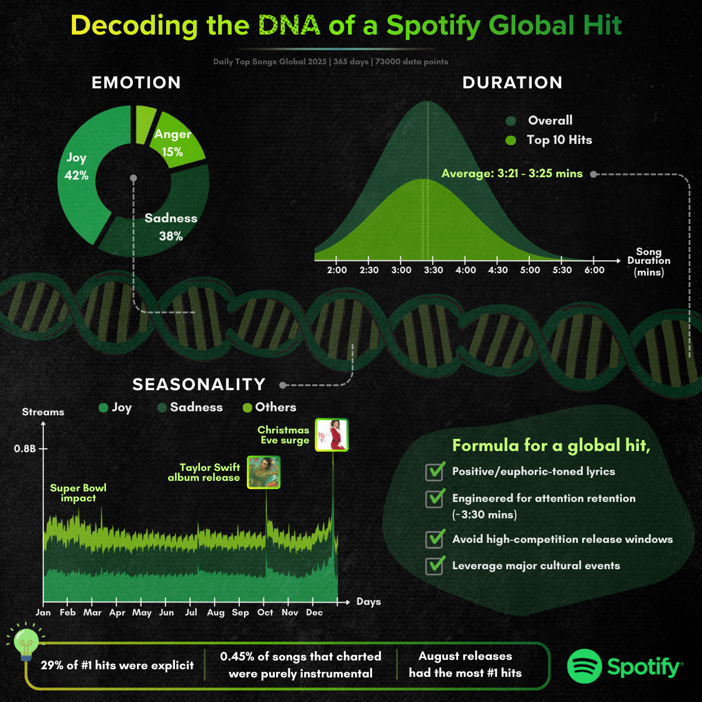

# 🎧 Decoding the DNA of a Spotify Global Hit

An end-to-end data pipeline analysing ~73,000 entries from Spotify’s Daily Top Songs Global chart in 2025 to uncover measurable patterns behind globally successful songs.

This independent project combines automation, API enrichment, transformer-based NLP experimentation and LLM-assisted emotion classification to explore the psychological and structural characteristics of global hits.

---

## 📊 Dataset Overview

- **Source:** Spotify Daily Top Songs Global - 200 chart positions, released daily
- **Timeframe:** Jan 1, 2025 - Dec 31, 2025 (365 days)
- **Total Chart Entries:** ~73,000
- **Unique Tracks:** Enriched via Spotify & Genius APIs
- **Final Output:** Emotion-labeled, metadata-enriched dataset for quantitative analysis

For this project, a “hit” is defined as:
Any song that enters Spotify’s Daily Top Songs Global chart in 2025 — meaning it ranks among the 200 most streamed songs globally on a given day.

---

## 🏗 Project Architecture

The project is structured as a reproducible multi-stage data pipeline:

### 1️⃣ Chart Scraping  
- Automated extraction of daily Spotify Global Top 200 rankings (Selenium)  
- Structured CSV storage per date  

### 2️⃣ Data Consolidation  
- Combined 365 daily files into a master dataset  
- Added temporal indexing  
- Sorted by date and rank  

### 3️⃣ Spotify API Enrichment  
- Pulled track-level metadata:
  - Duration  
  - Popularity score
  - Explicit flag  
  - Album/Single cover image URL  
  - Artist genre

### 4️⃣ Genius Lyrics Enrichment  
- Retrieved full lyrics  
- Cleaned section headers and embedded metadata  
- Standardised text for NLP processing  

### 5️⃣ Emotion Classification: From RoBERTa to LLM Reasoning

To quantify the emotional composition of global hit songs, multiple NLP approaches were tested before finalising the framework.

---

#### 🧪 Phase 1: Transformer-Based Emotion Classification (RoBERTa)

All lyrics were passed through the Hugging Face model:

**j-hartmann/emotion-english-distilroberta-base**

This model predicts probabilities across seven emotion categories:
- Anger
- Disgust
- Fear
- Joy
- Neutral
- Sadness
- Surprise

Although technically robust, manual review revealed critical limitations.

The model frequently interpreted lyrics at face value, struggling with:
- Sarcasm
- Metaphor
- Narrative framing
- Emotional tension

Example:
“Cruel Summer” – Taylor Swift  
The model classified it primarily as Disgust/Anger due to negative lexical tokens such as “cruel”.  
However, the song is narratively about anxious romantic longing, closer to Fear/Joy than hostility.

Conclusion:
Even transformer-based classifiers may struggle with figurative language and contextual nuance in music.

---

#### 🤖 Phase 2: Constrained LLM-Assisted Classification (Gemini)

To improve contextual accuracy, I pivoted to a large language model approach using Google Gemini (Google Sheets AI, February 2026 release).

Workflow:

1. Lyrics translated to English (where required)
2. Emotion classification constrained to Paul Ekman’s six core emotions:
   - Joy
   - Sadness
   - Anger
   - Fear
   - Surprise
   - Disgust
3. Single dominant emotion per track
4. Manual validation performed
5. Final labeled dataset stored for structured analysis

By constraining output categories and validating results, this approach produced significantly more coherent emotion tagging compared to the pretrained RoBERTa model.

---

## 🔍 Key Findings

### 🎵 Emotional Composition
- Joy: 42%  
- Sadness: 38%  
- Anger: 15%  
- Remaining categories: minority share  

Global hits are predominantly emotionally positive or introspective rather than aggressive.

---

### ⏱ Duration Sweet Spot
- Global hits cluster around **3:21 – 3:25 minutes**
- Songs appear optimised for attention retention and replay behaviour

---

### 📅 Seasonality & Cultural Impact
Clear streaming spikes observed during:

- Super Bowl period  
- Major album releases by global pop artists
- Christmas Eve surge  

Indicating strong interaction between music performance and cultural events.

---

### 🔞 Content Patterns
- 29% of #1 hits were explicit  
- Only 0.45% of charting songs were purely instrumental  
- August releases produced the highest number of #1 hits  

---

## 🧠 Analytical Focus

This project explores:

- Emotional resonance in hit music  
- Duration optimisation trends  
- Cultural event amplification effects  
- Release timing strategy  
- Explicit content prevalence  

It demonstrates how structured data pipelines combined with LLM-assisted classification can produce measurable cultural insights.

---

## 🛠 Tech Stack

- Python  
- Pandas  
- Selenium  
- Spotipy (Spotify API)  
- LyricsGenius (Genius API)
- Hugging Face Transformers
- Google Gemini (LLM classification via Google Sheets AI)  
- Excel / Google Sheets
- Flourish (chart visualisation)
- Canva (infographic design)

---

## 🔐 Setup & Execution Guide

This project requires API credentials:

- Spotify Developer API  
- Genius API  

1. Install required packages
   `pip install -r requirements.txt`
   
2. Create a `.env` file based on `.env.example` before running scripts.

3. Download daily charts  
   `python spotify_charts_csv_downloader.py`

4. Combine CSV files  
   `python combine_charts.py`

5. Enrich with Spotify metadata  
   `python spotify_enrichment.py`

6. Fetch lyrics  
   `python genius_lyrics_enrichment.py`

7. Run RoBERTa emotion scoring (Optional)  
   `python emotion_scorer_roberta.py`

The final LLM-based emotion classification (Gemini) was performed externally via the AI() function in Google Sheets.

---

## 📈 Final Output

The enriched and emotion-labeled dataset was used to generate the analytical infographic:

---

## 🚀 Future Improvements

- Fully programmatic LLM-based emotion classification via API  
- Genre-emotion interaction modeling  
- Chart longevity analysis
- Predictive modeling of the probability of a global hit

## ⚖️ Disclaimer

This is an independent personal project conducted for analytical and educational purposes.

It has no affiliation with Spotify, Genius, Google, or any artists referenced.  
All chart data was collected from publicly accessible rankings.
